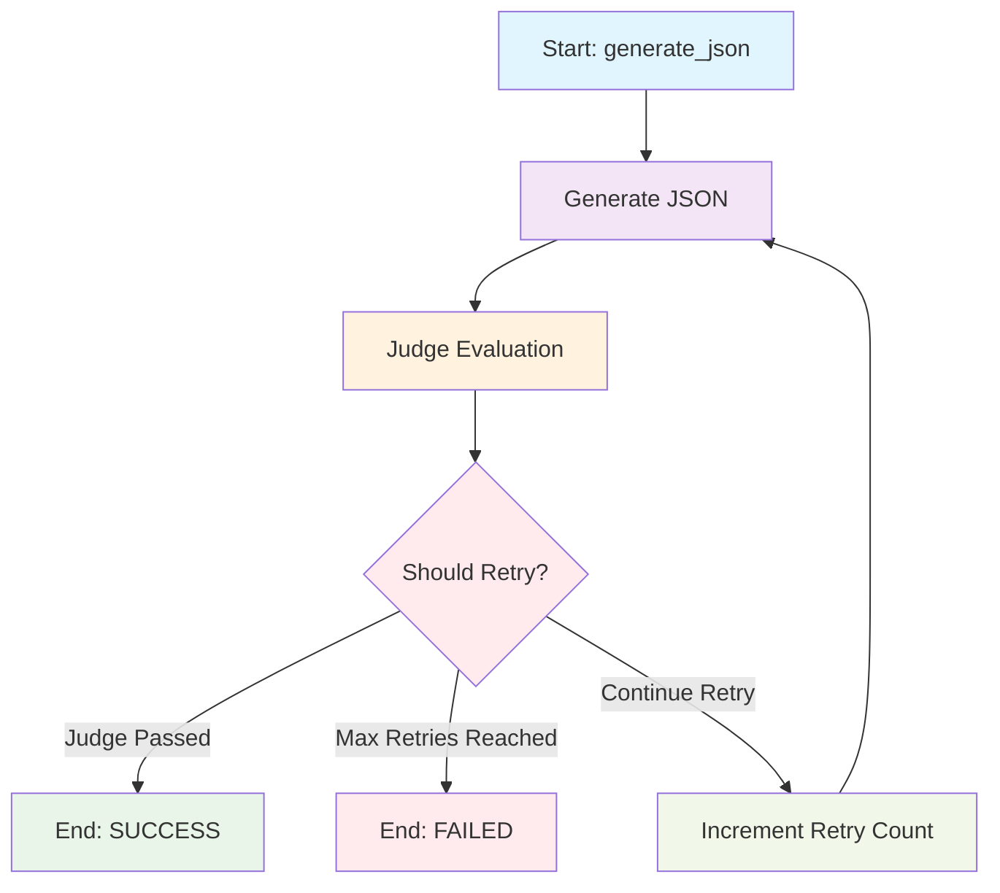

# Workflow Agent

Clean and efficient system for converting natural language instructions to JSON workflows using OpenAI models with multiple model implementations.

## ✨ Features

- **OpenAI Integration**: Uses GPT-4o and GPT-4o-mini models
- **Multiple Models**: Baseline model vs LangGraph model with retry logic
- **JSON Generation**: Convert instructions to structured workflow JSON
- **Triple Evaluation**: Exact match + LLM with GT + LLM-as-Judge (no GT)
- **LLM-as-Judge**: Evaluate generation quality without ground truth
- **Retry Logic**: LangGraph model retries until LLM-as-Judge passes
- **Excel Export**: Comprehensive results with all evaluation metrics
- **Clean Architecture**: Simple, modular, well-documented

## 🚀 Quick Start

```bash
# Install dependencies
pip install -r requirements.txt

# Method 1: Create .env file (Recommended)
echo "OPENAI_API_KEY=your-api-key-here" > .env

# Method 2: Set environment variable
export OPENAI_API_KEY="your-api-key-here"

# Method 3: Interactive setup
python setup_api_key.py

# Run full evaluation
python workflow_agent.py

# Quick test
python tests/quick_test.py

# Demo without API key
python demo_without_api.py
```

## 🎯 Supported Workflow Types

1. **LLM**: Q&A and assistance tasks with tools
2. **Sequential**: Step-by-step execution
3. **Parallel**: Simultaneous execution
4. **Loop**: Repetitive execution with iterations

## 🤖 Model Architecture Comparison

### 📊 Baseline Model (`baseline_model.py`)
**Simple and Fast JSON Generation**

```python
class BaselineWorkflowAgent:
    """기본 베이스라인 모델: json_chain만 사용하는 단순한 구현"""
```

#### 🔧 **Architecture:**
```
Input → JSON Chain → Output
     ↓
   (No Retry)
```

#### ✨ **Features:**
- **Simple Chain**: `ChatPromptTemplate → LLM → StrOutputParser`
- **No Retry Logic**: Single attempt JSON generation
- **Fast Execution**: Minimal processing overhead
- **Consistent Output**: Temperature 0.0 for deterministic results
- **Error Handling**: Fallback JSON on parsing errors

#### 📈 **Performance Characteristics:**
- **Speed**: ⚡ Very Fast (1-2 seconds per instruction)
- **Accuracy**: 📊 Moderate (depends on prompt quality)
- **Reliability**: 🔄 Single attempt, no self-correction
- **Resource Usage**: 💾 Low memory and API calls

#### 🎯 **Best Use Cases:**
- Quick prototyping and testing
- High-volume batch processing
- When speed is more important than accuracy
- Simple workflow generation tasks

---

### 🧠 LangGraph Model (`langgraph_model.py`)
**Advanced Conditional Edge Retry Logic**

```python
class LangGraphRetryAgent:
    """LangGraph Conditional Edge Retry Agent
    conditional edge를 이용한 우아한 retry 로직"""
```

#### 🔧 **Architecture:**
```
Input → Generate JSON → Judge → {Should Retry?}
                              ↓
                        ┌─ Yes → Increment Retry → Generate JSON
                        └─ No → End (Success/Failed)
```

#### 🎨 **Visual Representation:**


#### ✨ **Features:**
- **Conditional Edges**: Smart branching based on judge results
- **Retry Logic**: Automatic retry until success or max attempts
- **State Management**: Complete workflow state tracking
- **Quality Assurance**: LLM-as-Judge evaluation at each step
- **Visual Output**: PNG graph generation for documentation

#### 📈 **Performance Characteristics:**
- **Speed**: 🐌 Slower (3-10 seconds per instruction)
- **Accuracy**: 🎯 High (self-correcting through retries)
- **Reliability**: ✅ High (multiple attempts with validation)
- **Resource Usage**: 💾 Higher (multiple API calls)

#### 🎯 **Best Use Cases:**
- Production-quality workflow generation
- When accuracy is critical
- Complex workflow patterns
- Research and development
- Documentation and visualization needs

---

### 🔄 **Model Comparison Summary**

| Aspect | Baseline Model | LangGraph Model |
|--------|----------------|-----------------|
| **Speed** | ⚡ Very Fast | 🐌 Slower |
| **Accuracy** | 📊 Moderate | 🎯 High |
| **Complexity** | 🔧 Simple | 🧠 Advanced |
| **Retry Logic** | ❌ None | ✅ Conditional |
| **Visual Output** | ❌ None | ✅ PNG Graphs |
| **Resource Usage** | 💾 Low | 💾 High |
| **Best For** | Prototyping | Production |

### 🚀 **When to Use Each Model**

#### **Choose Baseline Model When:**
- ✅ You need quick results
- ✅ Processing large batches
- ✅ Simple workflow patterns
- ✅ Limited API budget
- ✅ Prototyping phase

#### **Choose LangGraph Model When:**
- ✅ Quality is paramount
- ✅ Complex workflow patterns
- ✅ Production deployment
- ✅ Need visual documentation
- ✅ Research and analysis

## 📊 Usage Examples

### 1. Baseline Model (Fast & Simple)
```python
from models.baseline_model import BaselineWorkflowAgent

# Initialize baseline model (fast, no retry)
agent = BaselineWorkflowAgent(model_name="gpt-4o-mini")

# Generate workflow
instruction = "콘텐츠 제작을 효율적으로 하는 시스템을 구축해줘. {텍스트작성Agent}, {이미지생성Agent}, {동영상편집Agent}가 동시에 작업하고 {콘텐츠통합Agent}가 최종 결과물을 만들도록 해"

result = agent.generate_workflow(instruction)

print(f"Model Type: {result['model_type']}")
print(f"Retry Attempts: {result['retry_attempts']}")  # Always 0 for baseline
print(f"Generated JSON: {result['label_json']}")

# Model info
info = agent.get_model_info()
print(f"Features: {info['features']}")
```

**Output:**
```
Model Type: baseline
Retry Attempts: 0
Generated JSON: {
  "flow_name": "ContentCreationPipeline",
  "type": "Sequential",
  "sub_agents": [
    {
      "flow": {
        "flow_name": "ContentProductionParallel",
        "type": "Parallel",
        "sub_agents": [
          {"agent_name": "텍스트작성Agent"},
          {"agent_name": "이미지생성Agent"},
          {"agent_name": "동영상편집Agent"}
        ]
      }
    },
    {"agent_name": "콘텐츠통합Agent"}
  ]
}
Features: json_chain only
```

### 2. LangGraph Model (Advanced with Retry)
```python
from models.langgraph_model import LangGraphRetryAgent

# Initialize LangGraph model with retry logic
agent = LangGraphRetryAgent(model_name="gpt-4o-mini", max_retries=3)

# Save graph visualization
agent.save_graph_as_png()  # Saves to ./models/langgraph_workflow_YYYYMMDD_HHMMSS.png

# Generate workflow with retry logic
instruction = "콘텐츠 제작을 효율적으로 하는 시스템을 구축해줘. {텍스트작성Agent}, {이미지생성Agent}, {동영상편집Agent}가 동시에 작업하고 {콘텐츠통합Agent}가 최종 결과물을 만들도록 해"

result = agent.generate_workflow(instruction)

print(f"Model Type: {result['model_type']}")
print(f"Retry Attempts: {result['retry_attempts']}")
print(f"Success: {result['success']}")
print(f"Judge Passed: {result['judge_passed']}")
print(f"Generated JSON: {result['label_json']}")

# Model info
info = agent.get_model_info()
print(f"Features: {info['features']}")
print(f"Max Retries: {info['max_retries']}")
```

**Output:**
```
Model Type: langgraph_conditional
Retry Attempts: 1
Success: True
Judge Passed: True
Generated JSON: {
  "flow_name": "ContentCreationPipeline",
  "type": "Sequential",
  "sub_agents": [
    {
      "flow": {
        "flow_name": "ContentProductionParallel",
        "type": "Parallel",
        "sub_agents": [
          {"agent_name": "텍스트작성Agent"},
          {"agent_name": "이미지생성Agent"},
          {"agent_name": "동영상편집Agent"}
        ]
      }
    },
    {"agent_name": "콘텐츠통합Agent"}
  ]
}
Features: json_chain + judge_chain + conditional_edges
Max Retries: 3
```

### 3. Performance Testing
```python
# Test baseline model performance
python models/baseline_model.py

# Test LangGraph model with visualization
python models/langgraph_model.py

# Run comprehensive test with test data
python test.py
```

### 3. Model Comparison
```python
# Compare both models
python compare_models.py

# Quick test with performance improvement focus
python quick_test.py
```

## 📁 Project Structure

```
workflow_agent/
├── models/                    # Model implementations
│   ├── __init__.py           # Model factory and exports
│   ├── baseline_model.py     # Simple baseline model (json_chain only)
│   └── langgraph_model.py    # LangGraph with retry logic
├── models.py                 # Legacy WorkflowAgent (compatibility)
├── workflow_agent.py         # Main execution script
├── quick_test.py            # Quick test (LLM-as-Judge focus)
├── compare_models.py        # Model comparison tool
├── utils.py                 # Utility functions
├── prompts.py               # Prompt templates
├── test_data.json           # Test dataset
├── requirements.txt         # Dependencies (includes langgraph)
└── README.md               # This documentation
```

## 🎮 How to Run

### 1. Full Evaluation (Legacy)
```bash
python workflow_agent.py
```
- Processes all test cases from `test_data.json`
- Uses baseline model for compatibility
- Runs **three evaluation methods**:
  1. **Exact Match** (with ground truth)
  2. **LLM Evaluation** (with ground truth)  
  3. **LLM-as-Judge** (no ground truth needed)
- Saves comprehensive results to Excel

### 2. Quick Test (Performance Focus)
```bash
python quick_test.py
```
- Tests single instruction with LLM-as-Judge
- **Performance improvement focus**
- Shows exact match vs LLM judge results
- Perfect for testing generation quality

### 3. Model Comparison
```bash
python compare_models.py
```
- Compares baseline vs LangGraph models
- Shows performance trade-offs
- Demonstrates retry logic benefits
- Tests on both single instruction and test data

### 4. Individual Model Testing
```bash
# Test baseline model
python models/baseline_model.py

# Test LangGraph model with retry
python models/langgraph_model.py
```

## 📊 Excel Output Format

| Test_ID | Instruction | Expected_JSON | Generated_JSON | JSON_Exact_Match | JSON_LLM_with_GT | LLM_Judge_no_GT | Total_Time | Judge_Eval_Time |
|---------|-------------|---------------|----------------|------------------|------------------|-----------------|------------|-----------------|
| 1 | 고객 문의... | {...} | {...} | O | O | O | 1.2s | 0.8s |

## 🔍 Evaluation Methods

### 1. Exact Match (with GT)
- **Purpose**: Strict structural comparison
- **Requires**: Ground truth test data
- **Use case**: Precise validation against known correct answers

### 2. LLM Evaluation (with GT) 
- **Purpose**: Semantic comparison with expected results
- **Requires**: Ground truth test data
- **Use case**: Flexible validation that understands meaning

### 3. LLM-as-Judge (no GT needed) ⭐
- **Purpose**: Evaluate if generation matches instruction intent
- **Requires**: Only instruction and generated result
- **Use case**: Real-world deployment where no ground truth exists

## 🛠️ Technical Details

- **Language Models**: OpenAI GPT-4o and GPT-4o-mini
- **Framework**: LangChain for LLM integration
- **Validation**: Simple JSON parsing + LLM semantic evaluation
- **Output**: Excel files with comprehensive metrics
- **Architecture**: Clean, modular, maintainable

## 📈 Performance Metrics

The system provides three evaluation perspectives:
- **Exact Match**: Structural accuracy percentage
- **LLM+GT**: Semantic accuracy with ground truth
- **LLM Judge**: Real-world applicability without ground truth

## 🎯 Key Benefits

1. **Simplified Codebase**: Removed complex Pydantic models
2. **LLM-as-Judge**: No ground truth needed for evaluation
3. **Production Ready**: Evaluate real instructions without test data
4. **Comprehensive Metrics**: Multiple evaluation angles
5. **Easy Maintenance**: Clean, readable code structure

## 💡 Real-World Usage

```python
# For production use - no ground truth needed
agent = WorkflowAgent()

# Generate workflow from user instruction
user_instruction = "사용자 입력을 처리하는 시스템 만들어줘"
result = agent.generate_workflow(user_instruction)

# Validate without ground truth
is_good = agent.judge_instruction_result(
    user_instruction, 
    json.dumps(result["label_json"])
)

if is_good:
    print("✅ Workflow generation successful!")
    # Use the generated workflow
else:
    print("⚠️ May need regeneration or refinement")
```

## 🔧 Troubleshooting

### API Key Issues
```bash
# Check if API key is set
echo $OPENAI_API_KEY

# Method 1: Create .env file (easiest)
python create_env.py

# Method 2: Manual .env file
echo "OPENAI_API_KEY=your-key-here" > .env

# Method 3: Environment variable
export OPENAI_API_KEY="your-key-here"

# Test without API key
python demo_without_api.py
```

### Common Errors
- **"api_key client option must be set"**: Run `python setup_api_key.py`
- **"No test data found"**: Ensure `test_data.json` exists in root directory
- **Import errors**: Run `pip install -r requirements.txt`

### Getting API Key
1. Visit [OpenAI Platform](https://platform.openai.com/api-keys)
2. Create account and generate API key
3. Set environment variable or use setup script

---

Built with ❤️ for clean, efficient workflow generation and evaluation.