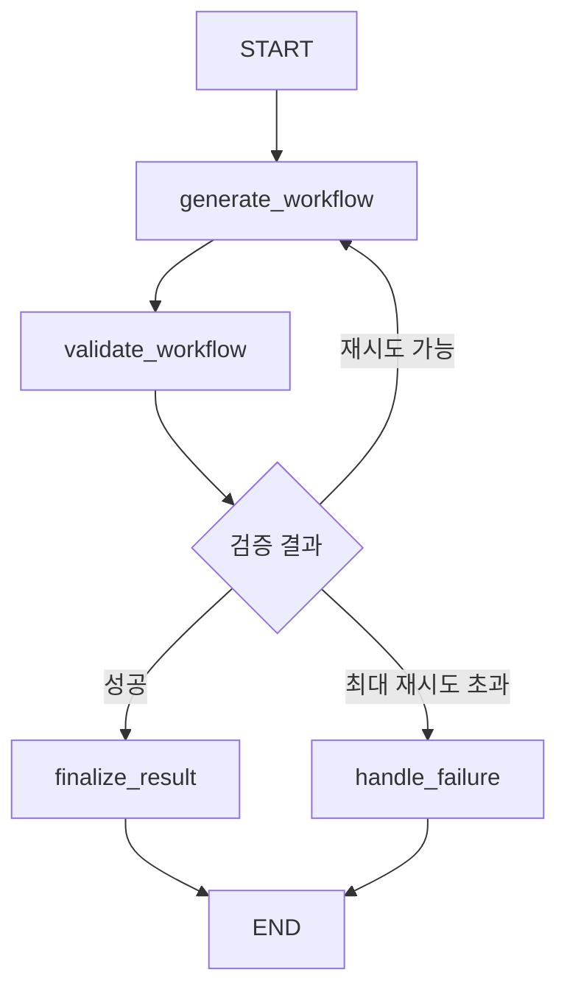

# LangGraph-based Workflow Agent

## 개요

LangGraph StateGraph를 사용하여 JSON 워크플로우 생성, 검증, 재시도 로직을 구현한 개선된 워크플로우 에이전트입니다.

## 주요 특징

### 🔄 State Graph Architecture
- **생성 노드**: JSON 워크플로우 생성
- **검증 노드**: 의미적/구조적 워크플로우 검증  
- **재시도 로직**: 검증 실패 시 자동 재시도
- **조건부 엣지**: 검증 결과에 따른 분기 처리

### 📊 4가지 워크플로우 타입 지원

1. **LLM 타입** - Q&A/지원 업무
```json
{
    "flow_name": "HRQNAAgent",
    "type": "LLM", 
    "sub_agents": [{"agent_name": "답변작성Agent"}],
    "tools": [{"agent_name": "직원정보Agent"}]
}
```

2. **Sequential 타입** - 단계별 실행
```json
{
    "flow_name": "DocumentPipelineAgent",
    "type": "Sequential",
    "sub_agents": [{"agent_name": "문서작성Agent"}, {"agent_name": "문서검토Agent"}]
}
```

3. **Sequential + Loop 타입** - 반복 개선
```json
{
    "flow_name": "IterativeReportPipeline", 
    "type": "Sequential",
    "sub_agents": [
        {"agent_name": "초기작성Agent"},
        {"flow": {"flow_name": "RefinementLoop", "type": "Loop", "sub_agents": [...]}}
    ]
}
```

4. **Sequential + Parallel 타입** - 복합 프로세스
```json
{
    "flow_name": "BusinessDevelopmentPipeline",
    "type": "Sequential", 
    "sub_agents": [
        {"flow": {"flow_name": "ParallelName", "type": "Parallel", "sub_agents": [...]}},
        {"agent_name": "SynthesisAgent"}
    ]
}
```

## State Graph 플로우



## WorkflowState 구조

```python
class WorkflowState(TypedDict):
    instruction: str              # 입력 지시사항
    generated_json: Dict[str, Any] # 생성된 JSON 워크플로우
    is_valid: bool                # 검증 결과
    validation_feedback: str      # 검증 피드백
    retry_count: int              # 현재 재시도 횟수
    max_retries: int              # 최대 재시도 횟수
    final_result: Dict[str, Any]  # 최종 결과
    error_message: str            # 에러 메시지
```

## 검증 로직

### 구조적 검증
- 필수 필드 확인: `flow_name`, `type`, `sub_agents`
- 유효한 타입 확인: `LLM`, `Sequential`, `Parallel`, `Loop`
- JSON 파싱 검증

### 의미적 검증
- **LLM 타입**: `tools` 필드 필수
- **Sequential/Parallel**: 최소 2개 sub_agents 필요
- **에이전트 명명**: 모든 에이전트명은 "Agent"로 끝나야 함
- **지시사항 매칭**: 키워드 기반 워크플로우 타입 적합성 검증

## 사용법

### 기본 사용
```python
from langgraph_models import LangGraphWorkflowAgent

agent = LangGraphWorkflowAgent(max_retries=3)
result = agent.generate_workflow("HR 문의에 답변하는 시스템을 만드세요")

print(f"성공: {result['success']}")
print(f"재시도 횟수: {result['retry_count']}")
print(f"워크플로우: {result['label_json']}")
```

### 평가 실행
```python
python workflow_agent.py
```

## 출력 예시

```
[1/6] Processing: HR 관련 문의사항에 답변하는 에이전트를 만드세요...
Results - JSON: ✅(exact) ✅(LLM) ✅(generated)
Time: 2.45s (Generation: 1.23s, Evaluation: 1.22s)
Feedback: Workflow is valid and complete

[2/6] Processing: 문서를 작성하고, 검토한 후, 수정하는 단계별 파이프라인...
Results - JSON: ✅(exact) ✅(LLM) ✅(generated) (Retries: 1)
Time: 3.67s (Generation: 2.34s, Evaluation: 1.33s)
Feedback: Workflow is valid and complete
```

## 개선 사항

1. **자동 재시도**: 검증 실패 시 피드백 기반 재생성
2. **상세한 검증**: 구조적/의미적 다층 검증  
3. **투명한 로깅**: 재시도 횟수, 검증 피드백 추적
4. **향상된 메트릭**: 생성 성공률, 평균 재시도 횟수 등
5. **유연한 구조**: State Graph로 쉬운 확장성

## 파일 구조

- `langgraph_models.py`: LangGraph 기반 워크플로우 에이전트
- `models.py`: 하위 호환성을 위한 별칭
- `workflow_agent.py`: 평가 실행 스크립트  
- `utils.py`: 비교/저장 유틸리티 (재시도 메트릭 포함)
- `test_data.json`: 4가지 워크플로우 타입 테스트 케이스
- `test_langgraph.py`: 구조 검증 테스트

## 의존성

```
langchain>=0.1.17
langchain-community>=0.0.37
langchain-core>=0.1.52
langgraph>=0.2.0
pandas>=2.2.1
openpyxl>=3.1.2
```
