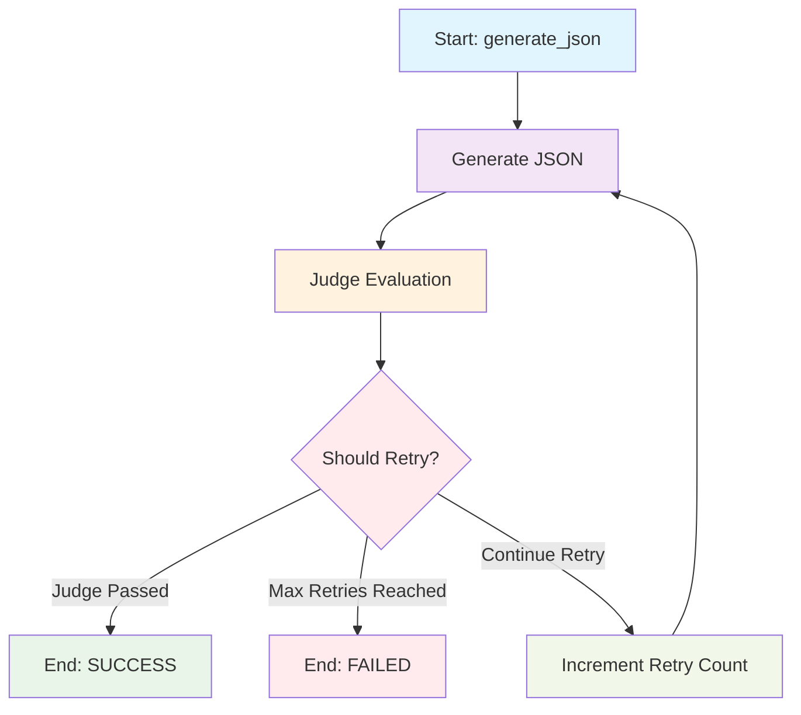

# Workflow Agent 코드 설명 자료

## 1. 목적/목표

### 1.1 프로젝트 개요
Workflow Agent는 한국어 자연어 지시문을 구조화된 JSON 워크플로우로 변환하는 AI 시스템입니다. 사용자가 한국어로 워크플로우를 설명하면, AI가 이를 분석하여 4가지 워크플로우 타입 중 하나로 분류하고 적절한 JSON 구조를 생성합니다.

### 1.2 핵심 목표
- **자연어 이해**: 한국어 지시문을 정확하게 파싱하고 의도 파악
- **워크플로우 분류**: 4가지 워크플로우 타입(LLM, Sequential, Loop, Parallel)으로 자동 분류
- **JSON 생성**: 표준화된 JSON 형식으로 워크플로우 구조 생성
- **품질 보장**: LLM-as-Judge를 통한 자동 품질 평가 및 재시도 로직
- **성능 비교**: Baseline 모델과 LangGraph 모델의 성능 비교 분석

### 1.3 해결하고자 하는 문제
- 복잡한 워크플로우 설계를 자연어로 간단하게 표현
- 워크플로우 구조의 표준화 및 일관성 확보
- AI 생성 결과의 품질 자동 검증
- 다양한 워크플로우 패턴의 체계적 관리

## 2. 생성할 데이터 설명

### 2.1 워크플로우 타입

#### 2.1.1 LLM 타입
- **용도**: Q&A, 지원 시스템, 도움말 시스템
- **특징**: 여러 에이전트에서 데이터를 가져와 응답 생성
- **구조**: `tools` 배열에 에이전트 목록 포함
- **예시**: 인사 문의, 법무 지원, 재고 조회 시스템

```json
{
  "flow_name": "HRQNAagent",
  "type": "LLM",
  "tools": [
    {"agent_name": "직원정보Agent"},
    {"agent_name": "급여정보Agent"}
  ]
}
```

#### 2.1.2 Sequential 타입
- **용도**: 단계별 순차 실행 프로세스
- **특징**: 에이전트들이 순서대로 작업 수행
- **구조**: `sub_agents` 배열에 순차 실행할 에이전트 목록
- **예시**: 고객 지원 파이프라인, 주문 처리 시스템

```json
{
  "flow_name": "CustomerSupportPipeline",
  "type": "Sequential",
  "sub_agents": [
    {"agent_name": "고객문의Agent"},
    {"agent_name": "답변작성Agent"},
    {"agent_name": "답변검토Agent"}
  ]
}
```

#### 2.1.3 Loop 타입
- **용도**: 반복적 개선 및 검토 프로세스
- **특징**: 초기 생성 후 반복적인 검토/수정 루프
- **구조**: 중첩된 `flow` 구조로 루프 로직 표현
- **예시**: 보고서 작성 및 교정, 코드 리뷰 프로세스

```json
{
  "flow_name": "IterativeReportPipeline",
  "type": "Sequential",
  "sub_agents": [
    {"agent_name": "초기작성Agent"},
    {
      "flow": {
        "flow_name": "RefinementLoop",
        "type": "Loop",
        "sub_agents": [
          {"agent_name": "비평Agent"},
          {"agent_name": "수정Agent"}
        ]
      }
    }
  ]
}
```

#### 2.1.4 Parallel 타입
- **용도**: 동시 실행 후 통합 작업
- **특징**: 여러 에이전트가 병렬로 작업 후 결과 통합
- **구조**: Parallel flow를 Sequential flow 내에 중첩
- **예시**: 시장조사/제품개발/마케팅 전략 동시 수행

```json
{
  "flow_name": "BusinessDevelopmentPipeline",
  "type": "Sequential",
  "sub_agents": [
    {
      "flow": {
        "flow_name": "ResearchAndDevelopmentParallel",
        "type": "Parallel",
        "sub_agents": [
          {"agent_name": "MarketResearchAgent"},
          {"agent_name": "ProductDevelopmentAgent"},
          {"agent_name": "MarketingStrategyAgent"}
        ]
      }
    },
    {"agent_name": "SynthesisAgent"}
  ]
}
```

### 2.2 데이터 구조 특징
- **에이전트 명명 규칙**: 모든 에이전트 이름은 "Agent"로 끝나야 함
- **flow_name**: 의미있는 영어 이름으로 지정
- **중첩 구조**: Loop와 Parallel 타입은 중첩된 flow 구조 사용
- **일관성**: 동일한 지시문에 대해 일관된 JSON 구조 생성

## 3. 사용 프롬프트

### 3.1 JSON 생성 프롬프트 (`JSON_PROMPT`)

#### 3.1.1 프롬프트 구조
```
Analyze the Korean instruction and generate a workflow JSON. 
Return ONLY the JSON object, no explanations or additional text.

You must create one of these 4 workflow types:
1. LLM type (for Q&A, assistance, help systems...)
2. Sequential type (for step-by-step processes...)
3. Loop type (for iterative refinement processes...)
4. Parallel type (for simultaneous execution followed by synthesis...)

Guidelines:
- LLM type: Use for Q&A/support systems that fetch data from multiple sources
- Sequential type: Use for step-by-step processes
- Loop type: Use for tasks requiring initial creation followed by iterative review/refinement
- Parallel type: Use for complex workflows with simultaneous work followed by integration
- Agent names must end with "Agent"
- flow_name should be meaningful English names
- Use exact agent names specified in {AgentName} format in the instruction

Examples:
[구체적인 예시들...]

Instruction: {instruction}
```

#### 3.1.2 프롬프트 특징
- **명확한 지시**: 4가지 워크플로우 타입을 명확하게 구분
- **구체적인 예시**: 각 타입별 실제 사용 사례 제공
- **명명 규칙**: 에이전트 이름과 flow_name 규칙 명시
- **한국어 지원**: 한국어 지시문 처리에 특화

### 3.2 LLM-as-Judge 프롬프트 (`INSTRUCTION_JUDGE_PROMPT`)

#### 3.2.1 프롬프트 구조
```
Evaluate if the generated JSON workflow correctly represents the given Korean instruction.

Original Instruction: {instruction}
Generated JSON: {generated_json}

Does the generated JSON correctly capture the intent and requirements of the instruction?
Consider:
- Workflow type appropriateness (LLM/Sequential/Loop/Parallel)
- Agent relevance and naming convention compliance
- Overall structure and completeness
- Logical flow matching the instruction
- Appropriateness of flow_name
- JSON structure correctness (tools vs sub_agents)
- Proper handling of nested flows for Loop/Parallel types
- Exact usage of agent names specified in {AgentName} format

Return ONLY: True or False
```

#### 3.2.2 프롬프트 특징
- **Ground Truth 불필요**: 원본 지시문과 생성된 JSON만으로 평가
- **다차원 평가**: 워크플로우 타입, 에이전트 관련성, 구조 완성도 등 종합 평가
- **명확한 출력**: True/False만 반환하여 파싱 용이성 확보
- **실용적 검증**: 실제 배포 환경에서 사용 가능한 평가 방식

## 4. Baseline 모델 (`baseline_model.py`)

### 4.1 클래스 구조

#### 4.1.1 `BaselineWorkflowAgent` 클래스
```python
class BaselineWorkflowAgent:
    """Baseline Workflow Agent - 기본 베이스라인 모델
    json_chain만 사용하는 단순한 구현 (retry 로직 없음)"""
```

#### 4.1.2 주요 메서드
- `__init__(model_name)`: OpenAI 모델 초기화
- `generate_json(instruction)`: JSON 구조 생성
- `generate_workflow(instruction)`: 완전한 워크플로우 생성
- `get_model_info()`: 모델 정보 반환

### 4.2 아키텍처

#### 4.2.1 단순 체인 구조
```
Input → JSON Chain → Output
     ↓
   (No Retry)
```

#### 4.2.2 구성 요소
- **LLM**: ChatOpenAI (temperature=0.0, max_tokens=512)
- **Parser**: StrOutputParser
- **Chain**: ChatPromptTemplate → LLM → Parser

### 4.3 특징

#### 4.3.1 장점
- **빠른 실행**: 단일 시도로 빠른 결과 생성
- **단순한 구조**: 복잡한 로직 없이 직관적
- **낮은 리소스 사용**: 최소한의 API 호출
- **일관된 출력**: Temperature 0.0으로 결정적 결과

#### 4.3.2 단점
- **재시도 없음**: 실패 시 자동 수정 불가
- **품질 제한**: 단일 시도로 인한 품질 한계
- **에러 처리**: 기본적인 fallback JSON만 제공

### 4.4 사용 사례
- 빠른 프로토타이핑 및 테스트
- 대량 배치 처리
- 속도가 정확도보다 중요한 경우
- 간단한 워크플로우 생성 작업

## 5. LangGraph 모델 (`langgraph_model.py`)

### 5.1 클래스 구조

#### 5.1.1 `LangGraphRetryAgent` 클래스
```python
class LangGraphRetryAgent:
    """LangGraph Conditional Edge Retry Agent
    conditional edge를 이용한 우아한 retry 로직"""
```

#### 5.1.2 주요 메서드
- `__init__(model_name, max_retries)`: 모델 및 재시도 횟수 초기화
- `generate_workflow(instruction)`: 재시도 로직을 포함한 워크플로우 생성
- `save_graph_as_png(output_dir)`: 그래프를 PNG 이미지로 저장
- `get_model_info()`: 모델 정보 반환

### 5.2 State, Node, Edge 구조

#### 5.2.1 WorkflowState (상태 정의)
```python
class WorkflowState(TypedDict):
    """워크플로우 상태"""
    instruction: str              # 원본 지시문
    generated_json: Dict[str, Any] # 생성된 JSON
    retry_count: int              # 현재 재시도 횟수
    max_retries: int              # 최대 재시도 횟수
    judge_passed: bool            # Judge 평가 통과 여부
    success: bool                 # 최종 성공 여부
    error_message: str            # 에러 메시지
```

#### 5.2.2 노드 (Node) 구조

**1. generate_json_node**
```python
def _generate_json_node(self, state: WorkflowState) -> Dict[str, Any]:
    """JSON 생성 노드"""
    # JSON 생성 로직
    # 에러 처리 및 fallback JSON 반환
```

**2. judge_node**
```python
def _judge_node(self, state: WorkflowState) -> Dict[str, Any]:
    """Judge 평가 노드"""
    # LLM-as-Judge를 통한 품질 평가
    # 재시도 횟수 증가 로직
```

#### 5.2.3 엣지 (Edge) 구조

**Conditional Edge**
```python
def _should_retry(self, state: WorkflowState) -> str:
    """Conditional edge: retry 여부 결정"""
    if state["judge_passed"]:
        return "end"           # Judge 통과 시 종료
    if state["retry_count"] >= state["max_retries"]:
        return "end"           # 최대 재시도 도달 시 종료
    return "retry"             # 재시도 계속
```

### 5.3 그래프 구조

#### 5.3.1 그래프 구성
```python
def _build_graph(self) -> StateGraph:
    """LangGraph 구성"""
    workflow = StateGraph(WorkflowState)
    
    # 노드 추가
    workflow.add_node("generate_json", self._generate_json_node)
    workflow.add_node("judge", self._judge_node)
    
    # 엣지 추가
    workflow.add_edge("generate_json", "judge")
    workflow.add_conditional_edges(
        "judge",
        self._should_retry,
        {
            "retry": "generate_json",  # 재시도 시 JSON 생성 노드로
            "end": END                  # 종료 시 그래프 종료
        }
    )
    
    workflow.set_entry_point("generate_json")
    return workflow.compile()
```

#### 5.3.2 그래프 흐름
```
Start: generate_json → judge → {Should Retry?}
                              ↓
                        ┌─ Yes → generate_json (재시도)
                        └─ No → End (성공/실패)
```

#### 5.3.3 시각적 표현


### 5.4 특징

#### 5.4.1 장점
- **재시도 로직**: Judge 평가 실패 시 자동 재시도
- **품질 보장**: LLM-as-Judge를 통한 지속적인 품질 검증
- **상태 관리**: 완전한 워크플로우 상태 추적
- **시각화**: PNG 그래프 생성으로 문서화 지원

#### 5.4.2 단점
- **느린 실행**: 여러 번의 API 호출로 인한 지연
- **복잡한 구조**: LangGraph 프레임워크 의존성
- **높은 리소스 사용**: 재시도로 인한 API 비용 증가

### 5.5 사용 사례
- 프로덕션 품질의 워크플로우 생성
- 정확도가 중요한 경우
- 복잡한 워크플로우 패턴
- 연구 및 개발 목적
- 문서화 및 시각화 필요

## 6. 테스트 코드 구조 (`test.py`)

### 6.1 테스트 구조

#### 6.1.1 메인 함수
```python
def main():
    """메인 함수"""
    parser = argparse.ArgumentParser(description="Workflow Agent Tester")
    parser.add_argument("--model", choices=["baseline", "langgraph"], default="baseline")
    parser.add_argument("--outdir", default="results", help="Directory to save Excel results")
```

#### 6.1.2 모델 선택
- **baseline**: BaselineWorkflowAgent 사용
- **langgraph**: LangGraphRetryAgent 사용 (lazy import)

### 6.2 테스트 데이터 처리

#### 6.2.1 데이터 로드
```python
def load_test_data():
    """테스트 데이터 로드"""
    with open("data/test_data.json", 'r', encoding='utf-8') as f:
        return json.load(f)
```

#### 6.2.2 데이터 정제
```python
def remove_flow_name(data):
    """flow_name 제거"""
    # flow_name 필드를 제거하여 정확한 비교 수행
```

### 6.3 평가 방식

#### 6.3.1 Exact Match 평가
```python
def exact_match_eval(generated, expected):
    """Exact match 평가 (flow_name 제외)"""
    return remove_flow_name(generated) == remove_flow_name(expected)
```

#### 6.3.2 평가 지표
- **Exact Match**: 구조적 정확도 (O/X)
- **Execution Time**: 실행 시간 (초)
- **Case ID**: 테스트 케이스 식별자
- **Type**: 워크플로우 타입 (LLM/Sequential/Loop/Parallel)

### 6.4 결과 저장

#### 6.4.1 Excel 저장
```python
def save_to_excel(results_data, summary_stats, model_type, output_dir):
    """결과를 엑셀 파일로 저장"""
    # 1) 상세 결과 시트
    # 2) 요약 통계 시트  
    # 3) 타입별 통계 시트
```

#### 6.4.2 시트 구성
- **Detailed Results**: 각 테스트 케이스의 상세 결과
- **Summary**: 전체 테스트 요약 통계
- **Type Analysis**: 워크플로우 타입별 분석

### 6.5 성능 분석

#### 6.5.1 통계 계산
```python
# 결과 출력
total_cases = len(test_data)
exact_match_rate = exact_matches/total_cases*100
avg_time = total_time/total_cases
```

#### 6.5.2 출력 정보
- **Exact Match**: 정확도 비율
- **Avg Time**: 평균 실행 시간
- **Model Type**: 테스트된 모델 타입
- **Total Cases**: 전체 테스트 케이스 수

## 7. Future Work

### 7.1 모델 개선

#### 7.1.1 프롬프트 최적화
- **다국어 지원**: 영어, 일본어 등 추가 언어 지원
- **도메인 특화**: 특정 업계별 프롬프트 템플릿 개발
- **컨텍스트 인식**: 더 복잡한 컨텍스트를 이해하는 프롬프트 설계

#### 7.1.2 모델 아키텍처
- **하이브리드 모델**: Baseline과 LangGraph의 장점 결합
- **적응형 재시도**: 컨텍스트에 따른 동적 재시도 전략
- **앙상블 접근**: 여러 모델의 결과를 조합하여 최적 결과 생성

### 7.2 기능 확장

#### 7.2.1 워크플로우 타입
- **Conditional 타입**: 조건부 실행 로직 추가
- **Event-driven 타입**: 이벤트 기반 워크플로우 지원
- **Hybrid 타입**: 여러 타입을 조합한 복합 워크플로우

#### 7.2.2 검증 및 테스트
- **자동화된 테스트**: CI/CD 파이프라인 통합
- **성능 벤치마크**: 다양한 모델과 설정의 성능 비교
- **A/B 테스트**: 프롬프트와 모델 설정의 효과 측정

### 7.3 사용자 경험 개선

#### 7.3.1 인터페이스
- **웹 대시보드**: 사용자 친화적인 웹 인터페이스 개발
- **실시간 피드백**: 생성 과정의 실시간 모니터링
- **시각적 편집기**: 드래그 앤 드롭 워크플로우 편집기

#### 7.3.2 통합 및 API
- **REST API**: 외부 시스템과의 통합을 위한 API 개발
- **플러그인 시스템**: 다양한 플랫폼과의 연동 지원
- **버전 관리**: 워크플로우 버전 관리 및 롤백 기능

### 7.4 성능 최적화

#### 7.4.1 속도 개선
- **배치 처리**: 여러 지시문을 동시에 처리하는 배치 모드
- **캐싱 시스템**: 유사한 지시문에 대한 결과 캐싱
- **병렬 처리**: 여러 모델 인스턴스를 동시에 실행

#### 7.4.2 리소스 효율성
- **모델 압축**: 더 작은 모델로 동일한 성능 달성
- **API 비용 최적화**: 효율적인 API 호출 전략
- **로컬 실행**: 클라우드 의존성 감소

### 7.5 확장성 및 안정성

#### 7.5.1 확장성
- **마이크로서비스**: 모듈화된 서비스 아키텍처
- **로드 밸런싱**: 고부하 상황에서의 분산 처리
- **수평적 확장**: 더 많은 인스턴스로 처리량 증가

#### 7.5.2 안정성
- **장애 복구**: 자동 장애 감지 및 복구 메커니즘
- **모니터링**: 실시간 성능 및 상태 모니터링
- **백업 및 복구**: 데이터 손실 방지를 위한 백업 시스템

### 7.6 연구 및 개발

#### 7.6.1 새로운 접근법
- **Few-shot Learning**: 적은 예시로 학습하는 방법 연구
- **Reinforcement Learning**: 사용자 피드백을 통한 모델 개선
- **Multimodal Input**: 텍스트 외 이미지, 음성 등 다양한 입력 지원

#### 7.6.2 평가 방법론
- **사용자 연구**: 실제 사용자들의 만족도 조사
- **정성적 평가**: 생성된 워크플로우의 품질 심층 분석
- **비교 연구**: 다른 워크플로우 생성 시스템과의 성능 비교

이러한 Future Work를 통해 Workflow Agent는 더욱 강력하고 사용자 친화적인 시스템으로 발전할 수 있을 것입니다.
