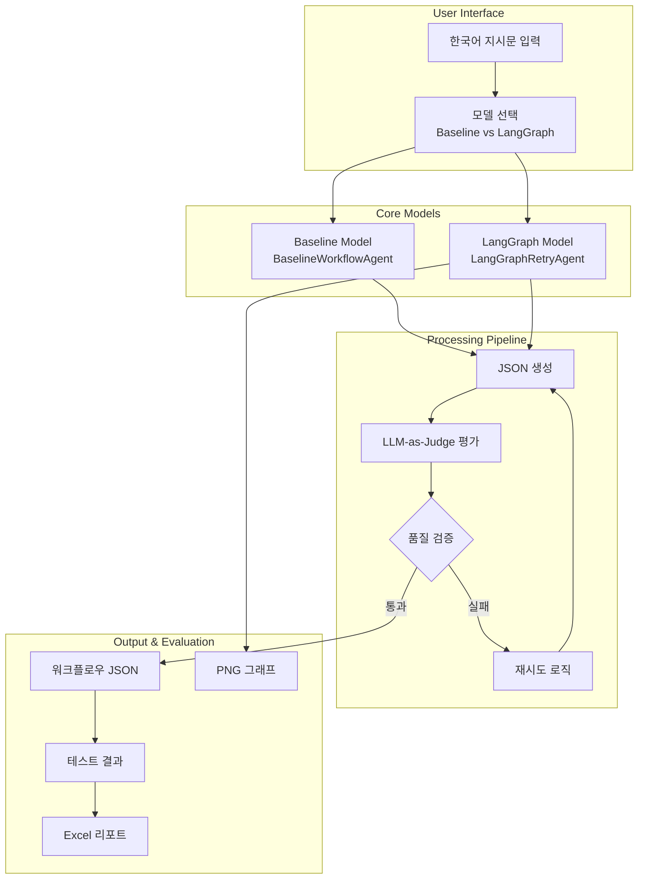
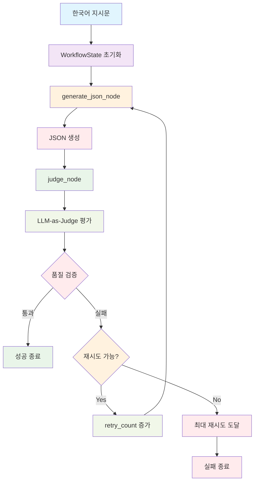
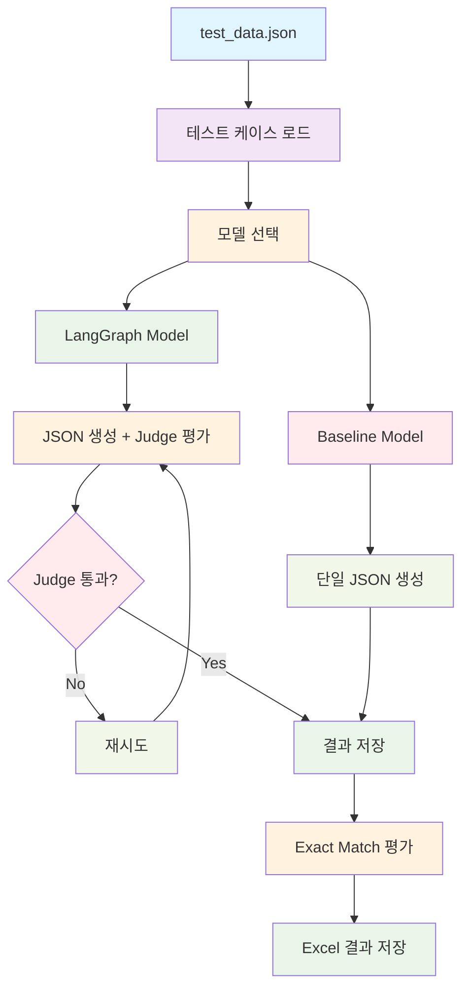
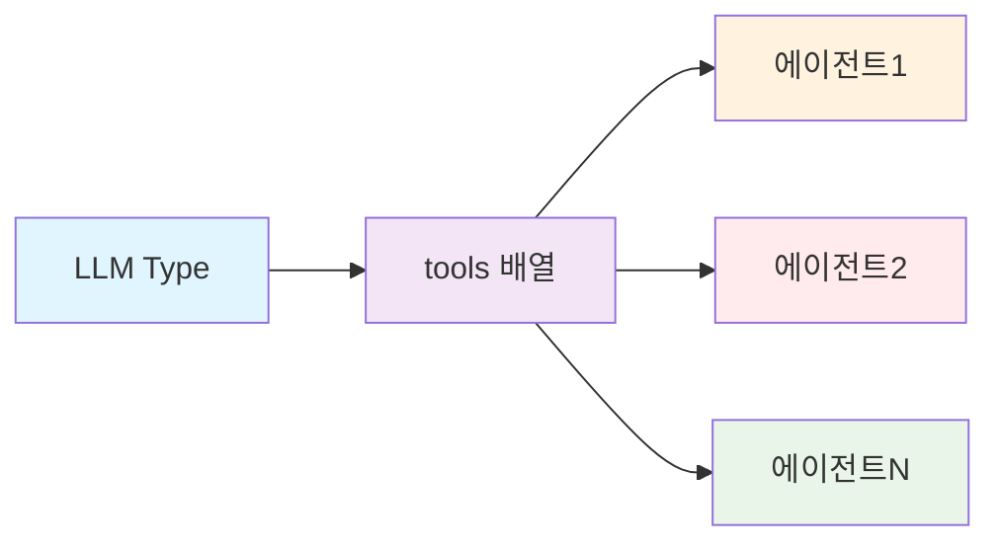
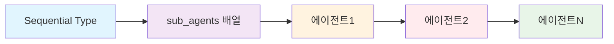
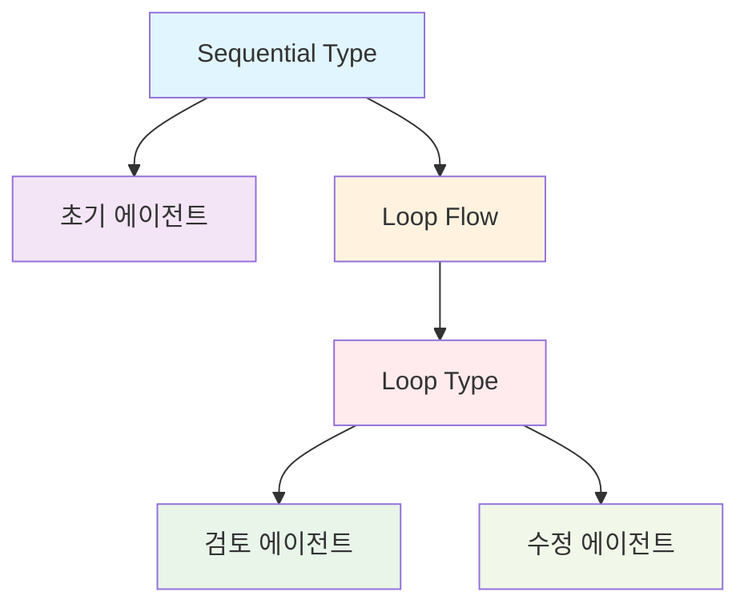
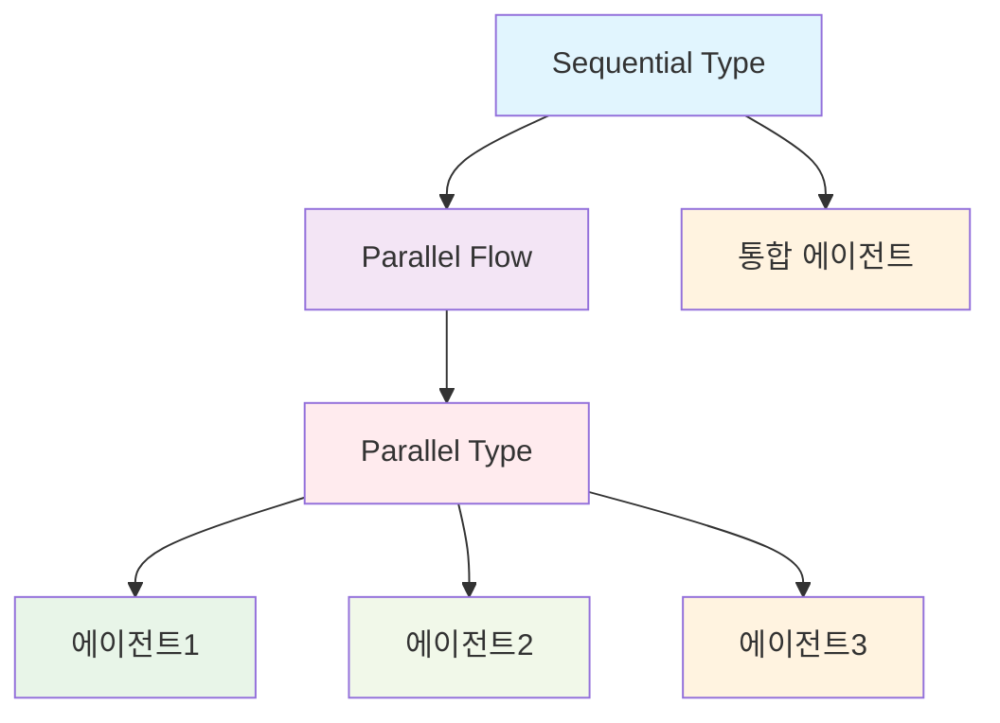
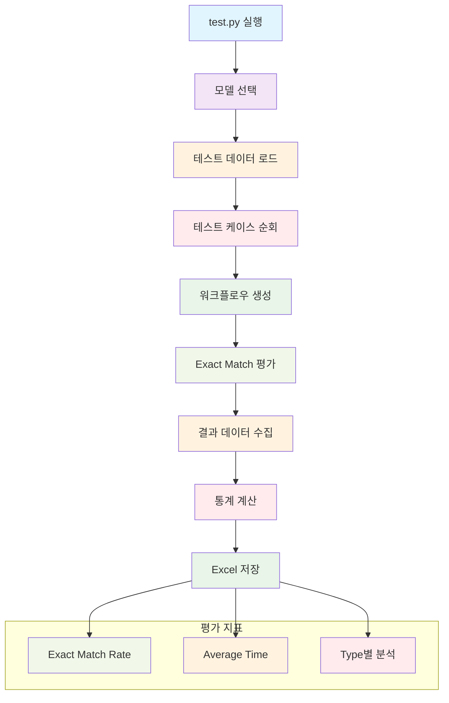
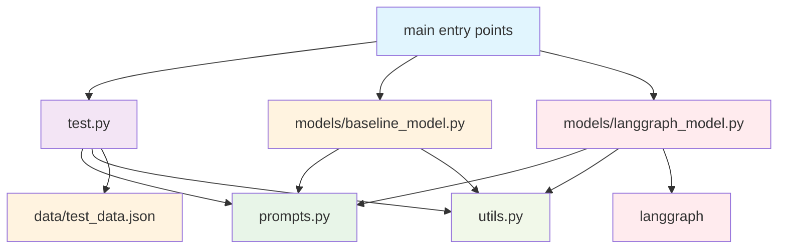
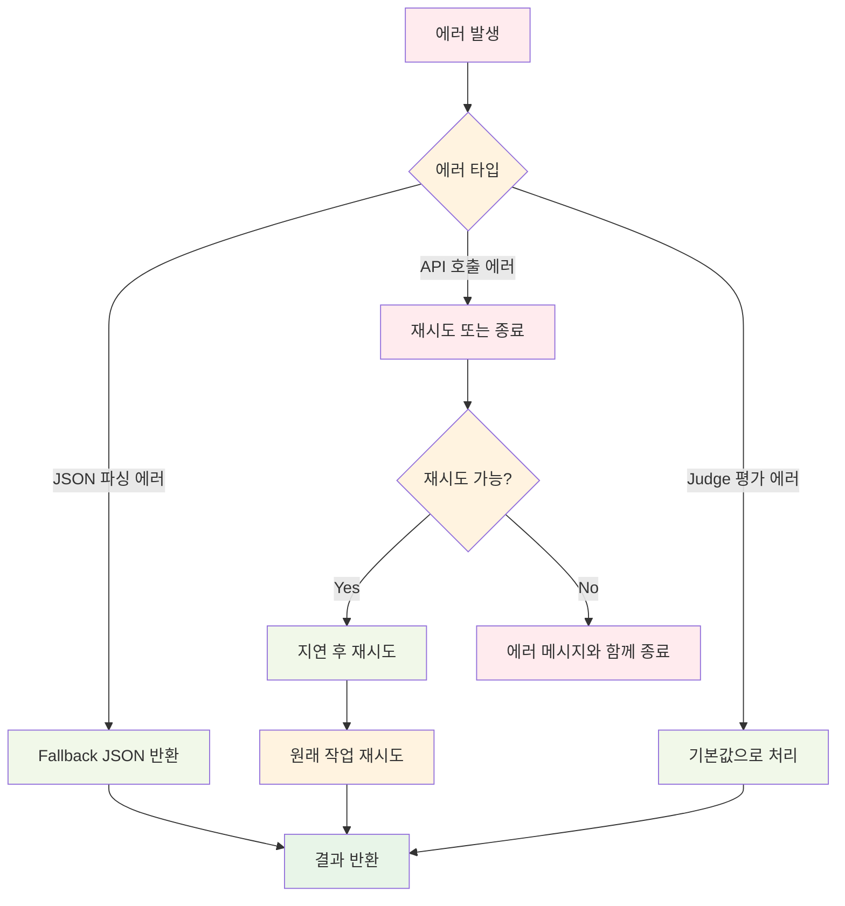

# Workflow Agent 프로젝트 아키텍처

## 1. 전체 시스템 아키텍처

## 2. Baseline Model 아키텍처

### 2.1 Baseline Model 특징
- **단순한 체인 구조**: Input → JSON Chain → Output
- **재시도 로직 없음**: 단일 시도로 빠른 결과 생성
- **낮은 리소스 사용**: 최소한의 API 호출
- **일관된 출력**: Temperature 0.0으로 결정적 결과

## 3. LangGraph Model 아키텍처

### 3.1 LangGraph Model 특징
- **Conditional Edge**: Judge 결과에 따른 조건부 재시도
- **상태 관리**: 완전한 워크플로우 상태 추적
- **품질 보장**: LLM-as-Judge를 통한 지속적인 품질 검증
- **시각화**: PNG 그래프 생성으로 문서화 지원

## 4. 데이터 흐름

## 5. 워크플로우 타입 구조

### 5.1 LLM 타입

### 5.2 Sequential 타입

### 5.3 Loop 타입

### 5.4 Parallel 타입

## 6. 테스트 시스템 구조

## 7. 파일 구조 및 의존성

## 8. 성능 비교 매트릭스

| 측정 지표 | Baseline Model | LangGraph Model |
|-----------|----------------|-----------------|
| **실행 속도** | ⚡ 매우 빠름 (1-2초) | 🐌 느림 (3-10초) |
| **정확도** | 📊 보통 | 🎯 높음 |
| **재시도 로직** | ❌ 없음 | ✅ 조건부 재시도 |
| **리소스 사용** | 💾 낮음 | 💾 높음 |
| **복잡도** | 🔧 단순 | 🧠 복잡 |
| **시각화** | ❌ 없음 | ✅ PNG 그래프 |
| **적합한 용도** | 프로토타이핑 | 프로덕션 |

## 9. 에러 처리 및 복구 전략

## 10. 확장성 고려사항

### 10.1 수평적 확장
- **로드 밸런싱**: 여러 모델 인스턴스 분산 처리
- **마이크로서비스**: 각 모델을 독립적인 서비스로 분리
- **API 게이트웨이**: 통합된 엔드포인트 제공

### 10.2 수직적 확장
- **모델 업그레이드**: 더 강력한 LLM 모델 사용
- **메모리 최적화**: 대용량 데이터 처리 최적화
- **병렬 처리**: 여러 워크플로우 동시 생성

### 10.3 기능적 확장
- **새로운 워크플로우 타입**: Conditional, Event-driven 등
- **다국어 지원**: 영어, 일본어 등 추가 언어
- **도메인 특화**: 업계별 맞춤형 프롬프트
